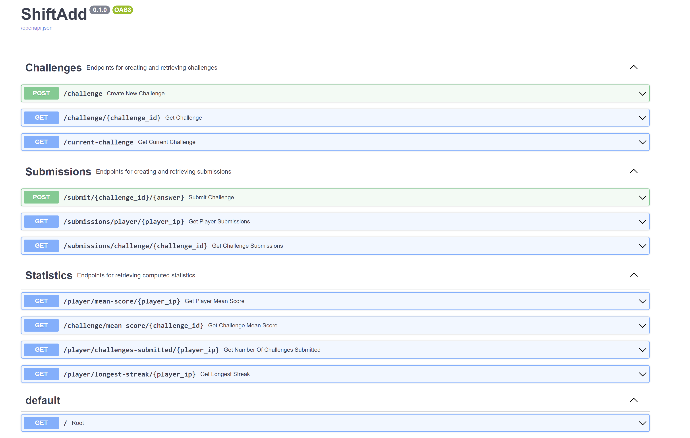

# ShiftAdd Design Docs

## Choice of Frameworks:
* I used FastAPI because of it's growing popularity, its speed, simplicity and integration with pydantic (coming from Java, I feel that doing proper type validation is super important!)
* I used SQLAlchemy because of it's good documentation and ORM pattern, which makes it easy to convert between objects and data row entries

## File structure:

* I generally believe that it's important to separate interface from implementation. In development this means that consumers of your APIs can be sure of the same inputs and outputs to expect even if you change the way you compute these values. It's also nice to semantically separate them so your code is more readable.
* Since this is a smaller project, I haven't fully done this since a lot of the implementation didn't take up too many lines of code and were mostly crud operations. Where there were lengthier computations, I separated those out into the "utils.py" file. However, ideally for bigger projects I would have a file something like "api.py" where I would write all the business logic and implementation, then in the main.py file, for each endpoint simply return "api.create_challenge" 

## Database:

* I was conscious that this task stated that persisting state in memory was enough, but I was quite keen to explore how integrating database operations worked in Python and FastAPI - hope that is okay!
* I used SQLAlchemy ORM which has tools to map between objects in code and database tables, which I wanted to try out. It is especially quite neat that you can very easily convert pydantic basemodel classes into a dict and pass that into the SQLAlchemy database model classes.
* For basemodels, originally I was going to make the ChallengeCreate object not have an id required for its instantiation, i.e. the id would be randomly generated after and saved in the Challenge object (you can see this commented out in schemas.py), but I had some difficulty doing this and debugging an issue so I went with generating the id before the resource creation... This probably isn't standard practice though, and if I had more time I would tweak it.  
* With more time I would also be interested in exploring using "relationships" in SQLAlchemy to back populate the challenge objects with a list of submissions. There is a one to many relationship between a challenge and its submissions, so doing this could save us time with querying things like getting all submissions for a challenge. But this is more just exploratory, it really depends on which queries we're trying to optimise for.

## API Design

* 

## Future improvements:

* I wanted to get the root call to return a html response template (using Jinja2) so I could display some html of the math problem and possibly allow the user to submit via that UI... to start creating some of the front end but I ran out of time to be able to get that working properly
* After some extra consideration, it might have been better to design the database and data models more centered around "Player" objects, rather than "Submission", i.e. have the db store players and then use a PUT call to update the player entry with a new submission/score with every challenge, rather than storing submissions only. This would make retrieving statistics for users a lot more efficient since we would just need to query for the player_id as opposed to filtering the submissions data for all with the specific player_id.
